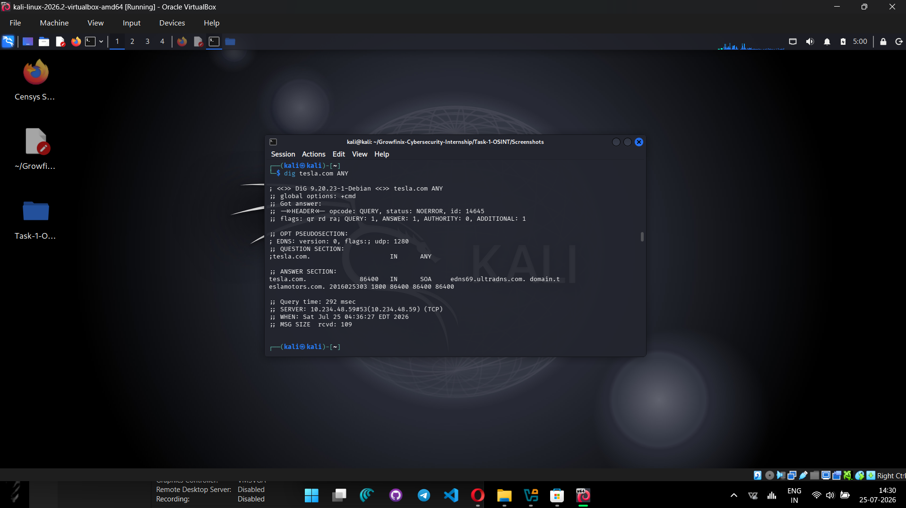
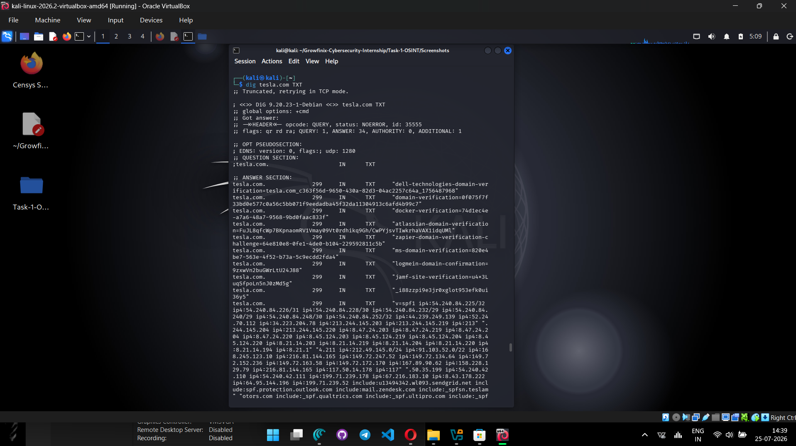

# Passive OSINT & Surface Reconnaissance

> **Growfinix Cybersecurity Internship — Task 1**
> Prepared by **Mohit Kumar**

[](#scope-and-ethics)
[](#scope-and-ethics)
[](Screenshots/)

This repository documents a **passive, public-information-only** reconnaissance exercise against `tesla.com`. It shows how publicly available registration, DNS, certificate-transparency, and DNS-indexing data can be collected, preserved, and interpreted responsibly during the early reconnaissance phase of a security assessment.

## Project snapshot

| Area | Summary |
| --- | --- |
| Registration | Public WHOIS metadata and authoritative name-server information were reviewed. |
| DNS | Public A/AAAA, MX, TXT, and SOA responses were collected. |
| Certificate transparency | CRT.sh and CertSpotter were queried through theHarvester. |
| Passive DNS | RapidDNS returned publicly indexed hostname/alias records. |
| Evidence | Six terminal screenshots support the documented collection steps. |

## Repository guide

| File / folder | What it contains |
| --- | --- |
| [REPORT.md](REPORT.md) | Objective, method, evidence-based findings, interpretation, and recommendations. |
| [COMMANDS.md](COMMANDS.md) | Reproducible command reference with a description of each source. |
| [Screenshots/](Screenshots/) | Terminal screenshots captured during collection. |
| `.gitignore` | Keeps raw collection artifacts out of the public repository. |

## Method at a glance

```text
Public WHOIS + DNS records + passive certificate/DNS indexes
                         |
                         v
              Evidence capture and review
                         |
                         v
     Contextual interpretation (no active validation)
                         |
                         v
       Asset-inventory and DNS-hygiene recommendations
```

## Key observations

- Public DNS answers showed a distributed, CDN-backed delivery footprint.
- Public MX records indicated Microsoft 365 mail routing.
- TXT records contained SPF and third-party domain-verification entries.
- The passive sources used returned one wildcard certificate entry (CertSpotter), no host result (CRT.sh), and 89 publicly indexed hostname/alias records (RapidDNS).

These results are **observations, not findings of vulnerability**. Public DNS records, certificates, and third-party verification strings are common components of a large organisation's Internet presence; they do not establish ownership, service availability, misconfiguration, or exploitability.

## Evidence

The complete evidence set is available in [Screenshots/](Screenshots/). Example captures include:

| DNS `ANY` response | DNS TXT response |
| --- | --- |
|  |  |

## Scope and ethics

This is an educational internship exercise using only information already exposed through public services. It did **not** include port scanning, vulnerability scanning, login attempts, exploitation, brute force, credential collection, social engineering, or active verification of discovered hosts.

The target was not treated as authorised for further testing. Any future validation must be performed only with explicit written permission and within an agreed scope.

## Reproduce responsibly

See [COMMANDS.md](COMMANDS.md) for the exact commands and the purpose of each. Tool output changes over time, so this repository treats the screenshots and report as a time-bound record of the collection, not as a current asset inventory.

## Disclaimer

All organisation names and public records are used solely for academic demonstration. This repository does not claim that any observed service is vulnerable or that a discovered hostname is currently active, owned, or in scope for testing.
